# Sơ đồ và Trình tự Hoạt động Hệ thống MeetingMind AI

Tài liệu này mô tả chi tiết quy trình xử lý luồng dữ liệu (workflow) từ khi tệp tin âm thanh cuộc họp được tải lên cho đến khi hoàn thành phân biệt người nói (Speaker Diarization) và tạo lập bản tóm tắt kết quả (Meeting Summary) lưu trữ vào Cơ sở dữ liệu.

---

## 1. Sơ đồ Tổng quan Luồng Hoạt động (System Architecture Diagram)

Dưới đây là sơ đồ Mermaid mô tả toàn bộ trình tự hoạt động, các chốt chặn dự phòng và cơ chế tự động phục hồi lỗi (API Fallback Layer) của hệ thống:

```mermaid
flowchart TD
    A[Người dùng tải lên tệp âm thanh cuộc họp] --> B{Hệ thống kiểm tra API Key?}
    
    %% Nhánh Đám mây (Mặc định)
    B -- Có GEMINI_API_KEY --> C[Đo thời lượng âm thanh]
    C --> D{Thời lượng > 5 phút?}
    
    D -- Có --> E[FFmpeg: Chia nhỏ tệp tin thành các segment 5 phút]
    D -- Không --> F[Giữ nguyên tệp đơn đoạn]
    
    E --> G[Chạy Parallel Audio Chunking qua ThreadPoolExecutor]
    F --> H[Gọi luồng xử lý đơn đoạn]
    
    G & H --> I[Bắt đầu bóc băng trên đám mây]
    
    %% Chuỗi dự phòng STT Đám mây
    I --> J{Thử model chính: gemini-2.5-flash}
    J -- Lỗi 429/503/404 --> K{Thử model dự phòng 1: gemini-2.0-flash}
    K -- Lỗi 429/503/404 --> L{Thử model dự phòng 2: gemini-2.5-flash-lite}
    
    J -- Thành công --> M[Parser: Quét dòng & Khử mốc thời gian lọc sạch thoại]
    K -- Thành công --> M
    L -- Thành công --> M
    
    %% Nhánh Ngoại tuyến (Fallback offline)
    B -- Không có API Key --> N[Bóc băng cục bộ Offline]
    L -- Tất cả model đám mây lỗi --> N
    
    N --> O[Faster-Whisper bóc băng chữ thô]
    O --> P[Gán nhãn mặc định: Unknown]
    P --> Q{Gán nhãn ngữ nghĩa: Semantic Diarization}
    
    %% Chuỗi dự phòng Diarization
    Q --> R{Thử Gemini API: gemini-2.5-flash -> gemini-2.0-flash -> gemini-2.5-flash-lite}
    R -- Thành công --> M
    R -- Thất bại --> S{Thử Ollama Local AI: qwen2.5:7b-instruct}
    S -- Thành công --> M
    S -- Thất bại --> T[Giữ nguyên nhãn mặc định Unknown]
    T --> M
    
    %% Tiến trình Tóm tắt (Summarization)
    M --> U[Hoàn tất bản bóc băng và gán nhãn người nói]
    U --> V{Yêu cầu tóm tắt bằng Gemini Cloud?}
    
    %% Chuỗi dự phòng LLM Tóm tắt
    V -- Có --> W{Thử Gemini: gemini-2.5-flash}
    W -- Lỗi 429/503/404 --> X{Thử Gemini dự phòng: gemini-2.0-flash}
    X -- Lỗi 429/503/404 --> Y{Thử Gemini dự phòng: gemini-2.5-pro}
    Y -- Lỗi 429/503/404 --> Z{Thử Gemini dự phòng: gemini-2.0-flash-lite}
    
    W -- Thành công --> AA[Chuẩn hoá JSON kết quả tóm tắt]
    X -- Thành công --> AA
    Y -- Thành công --> AA
    Z -- Thành công --> AA
    
    V -- Không/Tất cả Gemini lỗi --> AB[Gọi Ollama Local AI: qwen2.5/llama3.2]
    AB --> AA
    
    AA --> AC[Hiển thị kết quả lên giao diện và lưu trữ vĩnh viễn vào SQLite]
```

---

## 2. Mô tả Chi tiết Trình tự Hoạt động (Step-by-Step Execution)

### Bước 1: Tiếp nhận và tiền xử lý âm thanh (Audio Ingestion & Pre-processing)
* **Kênh truyền**: Người dùng nhấp nút ghi âm trực tiếp hoặc tải tệp âm thanh (`mp3`, `wav`, `mp4`, `m4a`) lên giao diện frontend (React Vite).
* **Đo lường thời lượng**: Backend FastAPI đo đạc thời lượng tệp tin qua `storage_service.py`:
  * **Tệp tin ngắn ($\le$ 5 phút)**: Chuyển tiếp trực tiếp sang tiến trình xử lý đơn đoạn.
  * **Tệp tin dài ($>$ 5 phút)**: Tự động kích hoạt **Parallel Audio Chunking** thông qua FFmpeg. Tệp âm thanh lớn được chia nhỏ thành các phân đoạn 5 phút (`ffmpeg -c copy`) cực kỳ nhanh chóng mà không làm giảm chất lượng hoặc tốn CPU re-encode.

---

### Bước 2: Bóc băng và Phân biệt người nói đám mây (Cloud STT & Native Diarization)
* **Tải song song (ThreadPoolExecutor)**: Các tệp phân đoạn được tải đồng thời lên Google Cloud Server thông qua SDK `google-genai`. Các phân đoạn được xử lý song song giúp tăng tốc tổng tiến trình bóc băng từ **5 đến 8 lần**.
* **Neo giữ chất lượng (Generation Configuration)**: Tất cả cuộc gọi API đều được khóa cứng `temperature=0.0` để tối ưu hóa tính nhất quán của kết quả và gắn kèm `system_instruction` định hướng vai trò chuyên gia bóc băng của AI.
* **Chuỗi chuyển đổi dự phòng mô hình (API Model Fallback Chain)**:
  * Mô hình chính `gemini-2.5-flash` được gọi trước tiên.
  * Nếu gặp lỗi quá tải (503), lỗi cạn kiệt hạn ngạch Free tier (429), hoặc lỗi không tồn tại (404), hệ thống bắt lỗi thông minh và tự động thử lại với mô hình tiếp theo: **`gemini-2.0-flash` $\rightarrow$ `gemini-2.5-flash-lite`**.

---

### Bước 3: Làm sạch và Phân tách dòng hội thoại (Robust Dialogue Parser)
* Sau khi nhận dữ liệu thô từ đám mây, hàm `clean_gemini_transcript` sẽ loại bỏ các phần Chain-of-Thought (Bước 1 và Bước 2 của prompt CoT) chỉ lấy lại phần hội thoại thực tế của Bước 3.
* **Trình parser mạnh mẽ (Robust Parser)**: Quét qua từng dòng thoại bằng Regex chuyên dụng để tách biệt nhãn người nói và nội dung câu thoại:
  * Tự động khử toàn bộ ngoặc vuông `[]`, dấu sao `**`, ngoặc đơn `()` và các mốc thời gian (timestamps) nằm trong nhãn tên người nói (ví dụ: `[Nguyễn Văn A] [00:12]: Xin chào` được chuẩn hóa thành `Nguyễn Văn A: Xin chào`).
  * Khắc phục hoàn toàn hiện tượng model dự phòng sinh mốc thời gian làm hỏng cấu trúc gán nhãn người nói.

---

### Bước 4: Luồng dự phòng Ngoại tuyến (Offline Fallback & Semantic Diarization)
Nếu toàn bộ đám mây đám mây Gemini bị lỗi hoặc người dùng ngắt kết nối internet hoàn toàn:
* **Bóc băng chữ thô**: Hệ thống tự động chuyển luồng về **Faster-Whisper chạy cục bộ offline** (mô hình `tiny`/`base`/`medium` tùy cấu hình trong `.env`). Tiến trình này bóc băng chính xác từng từ ngữ nhưng gán nhãn người nói mặc định là `Unknown`.
* **Gán nhãn người nói ngữ nghĩa (Semantic Diarization)**:
  * Hệ thống gom nhóm tối đa 200 câu thoại thô, gửi kèm thông tin về vai trò Host/Participants của cuộc họp tới LLM.
  * LLM đám mây (Gemini) hoặc LLM cục bộ chạy offline (**Ollama Local AI** sử dụng mô hình như `qwen2.5:7b-instruct`) sẽ đọc hiểu toàn bộ văn cảnh đối thoại, phân tích đại từ nhân xưng và luồng tranh luận để gán lại tên người nói chính xác tuyệt đối.

---

### Bước 5: Tiến trình tóm tắt và phân tích cuộc họp (Meeting Summarization Pipeline)
Sau khi có bản bóc băng sạch:
* Hệ thống tiến hành tóm tắt cuộc họp để trích xuất 4 trường thông tin bắt buộc: **Tóm tắt tổng quan (prose summary)**, **Chủ đề chính (key topics)**, **Quyết định đã chốt (decisions)**, và **Đầu việc được giao (action items)**.
* **Chuỗi dự phòng tóm tắt đám mây**:
  * Tự động đảo tuần tự qua danh sách các mô hình LLM đám mây hiệu năng cao: **`gemini-2.5-flash` $\rightarrow$ `gemini-2.0-flash` $\rightarrow$ `gemini-2.5-pro` $\rightarrow$ `gemini-2.0-flash-lite`**.
  * Hạn chế tối đa lỗi gián đoạn do hết hạn mức API hoặc máy chủ Google bận.
* **Chốt chặn Ollama Local**: Nếu toàn bộ đám mây thất bại, hệ thống tự động gọi API cục bộ của Ollama (`qwen2.5:7b-instruct`) để phân tích tóm tắt offline không phụ thuộc internet.

---

### Bước 6: Đồng bộ Cơ sở dữ liệu và Hiển thị giao diện (SQLite & Frontend Sync)
* **Lưu trữ SQLite**: Kết quả bóc băng chi tiết và cấu trúc tóm tắt JSON được ghi nhận vĩnh viễn vào cơ sở dữ liệu `meetingmind.db` thông qua SQLAlchemy.
* **Đồng bộ UX**: Frontend React cập nhật lại trạng thái giao diện tức thời:
  * Hiển thị bảng điều khiển đếm giây AI sinh động khi đang phân tích.
  * Tự động cập nhật bảng công việc Kanban dựa trên danh sách đầu việc `action_items` vừa được sinh ra để nhóm dự án bắt đầu làm việc.
